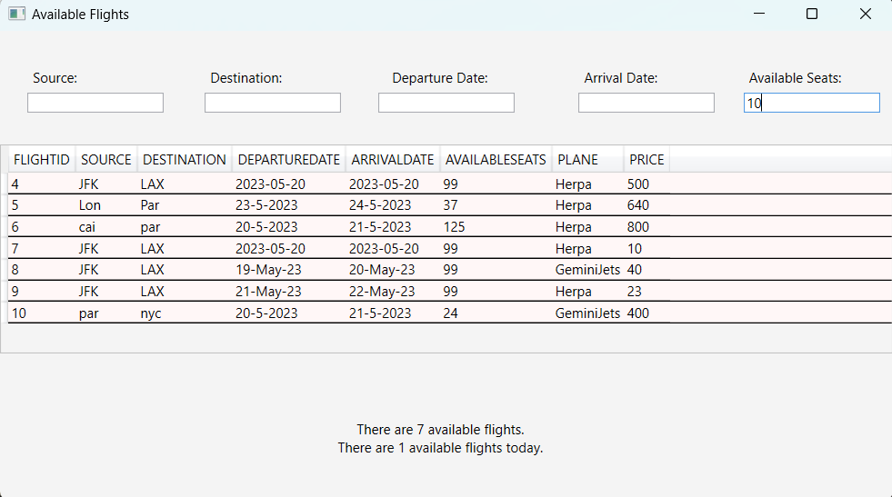

# Flight Reservation System

## Introduction

The Flight Reservation System is a software application developed using C# that enables users to book, cancel, and modify flights. This system simplifies the airline reservation process by allowing customers to easily search and book flights based on their preferred travel dates, source, and destination. The system also provides administrators with the ability to manage aircraft, flights, and customers.

## Functionalities

- **User Management**
  - Signing up a new user (admin or customer)
  - Updating user details

- **Aircraft Management** (Admin only)
  - Adding an aircraft
  - Updating aircraft details

- **Flight Management** (Admin only)
  - Adding a flight
  - Updating flight details

- **Flight Search and Booking**
  - Showing a list of available flights based on criteria (date, source, destination, required number of seats)
  - Performing operations on flights: booking, canceling, changing flight class

## Conceptual ERD

## Corresponding Physical ERD

## Database Implementation on MS SQL Server

The Flight Reservation System uses MS SQL Server as the database management system. The database includes tables for User, Aircraft, Flight, Reservation, and Payment, which are created based on the physical ERD. The tables are linked through foreign keys, and the relationships between the tables correspond to the relationships in the conceptual ERD. The database is updated whenever there is a new reservation, cancellation, or modification to a flight.

## Application Implementation

The application program implemented using C# includes the following features:

- **Insert Operations**
  - 2 insert statements on 2 different tables

- **Delete Operations**
  - 2 delete statements on 2 different tables (with conditions)

- **Update Operations**
  - 2 update statements on 2 different tables (with conditions)

- **Data Retrieval**
  - Select data from any tables of the database
  - Select data that involves more than one table of the database (using joins)

- **Report Generation**
  - Generation of meaningful reports

- **User Interface**
  - Implementation of a GUI

## Screenshots

Here are some screenshots of the application in action:

## Home Page
)

### User Registration

### Admin Login

### Available Flights

### Users Flights Update

## 🤝 Contributors

This project is maintained by the following contributors:

- [Youssef Moataz](https://github.com/YoussefMoataz)
- [Hassan Magdi](https://github.com/hassan1876)
- [Nourhan Mahmoud](https://github.com/NourhanMahmoudd)
- [Rawan Tarek](https://github.com/rawwaanntarekk)
- [Shaden Ali](https://github.com/ShadenAli95)
